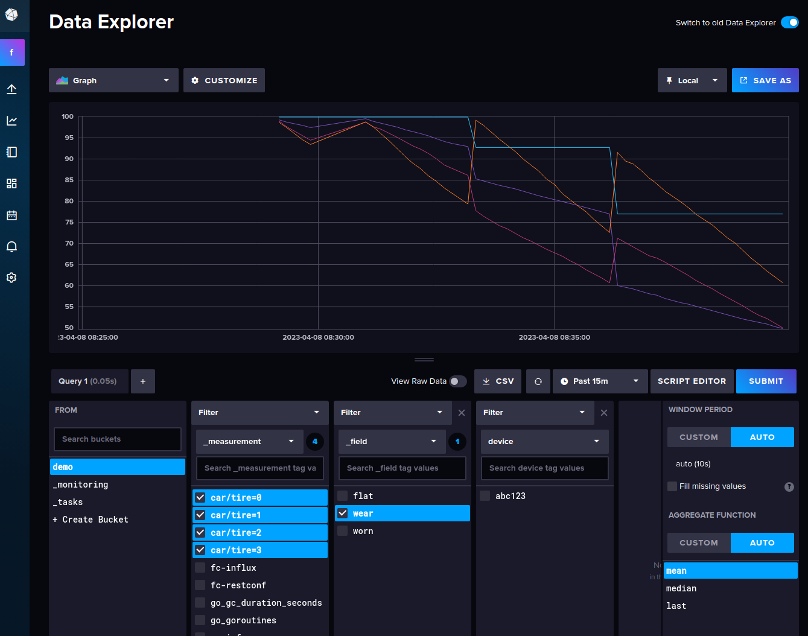
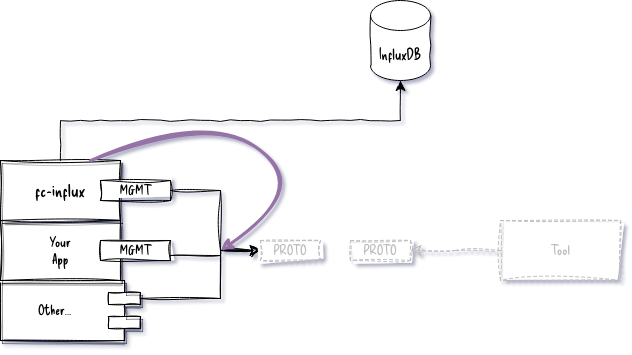
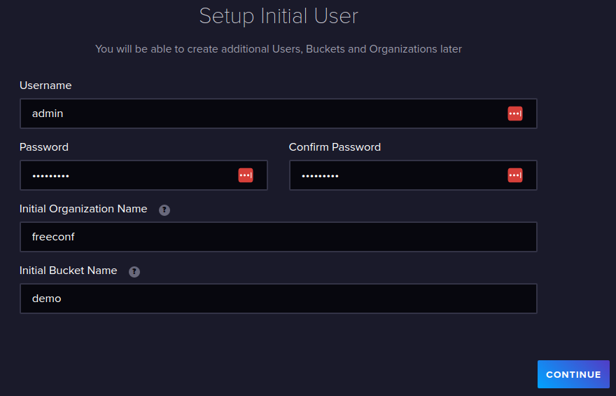
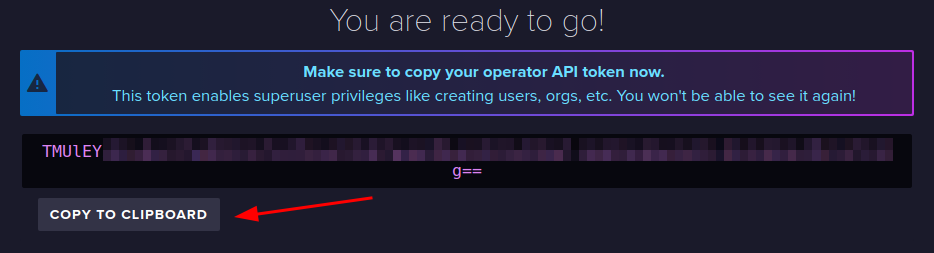
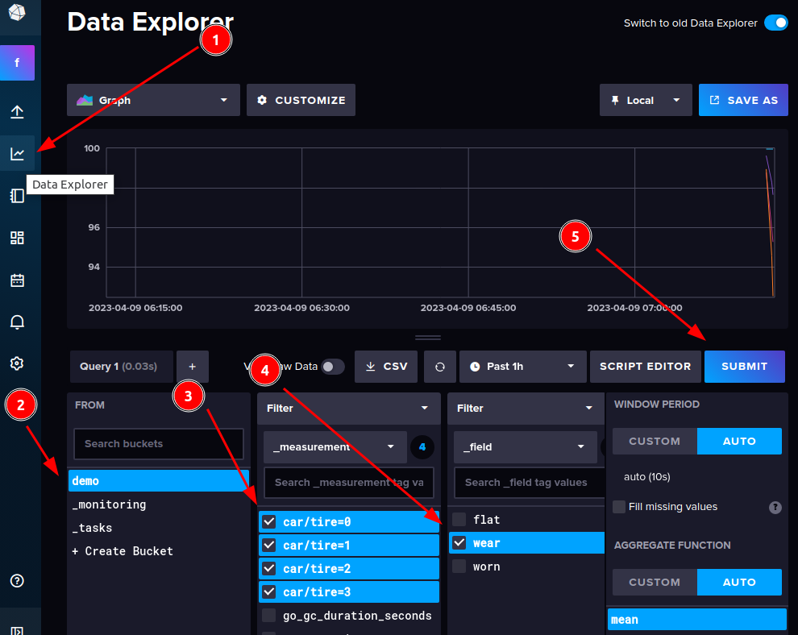
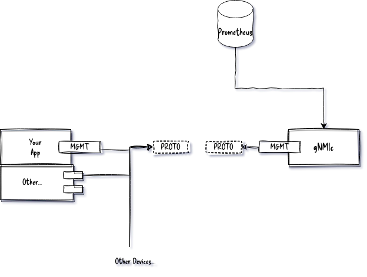
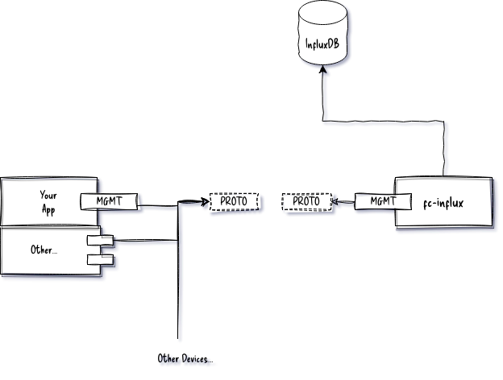

## Demonstrates:

* How to use export FreeCONF application metrics to InfluxDB w/o coupling your application code from InfluxDB

## Details

The `fcinflux.Service` walks thru all the local management interfaces and auto-discovers all metrics (i.e. `config false` in YANG) and sends them to InfluxDB at a configurable frequency.



### Inside the code

#### "Walking" the metrics.

FreeCONF API to recursively send metrics to InfluxDB.

```go
package fcinflux

import (
	"github.com/freeconf/yang/node"
	"github.com/freeconf/yang/nodeutil"
	"github.com/freeconf/yang/val"
)

// nodeWtr implements the FreeCONF node interface and acts like a "writer"
// when traversing a node tree with Selection.UpsertInto(<thisWriter>). There
// are other ways to accomplish walking a tree but this seemed easiest.
func nodeWtr(s sink, m Metric) node.Node {
	fields := make(map[string]interface{})
	return &nodeutil.Basic{
		OnField: func(r node.FieldRequest, h *node.ValueHandle) error {
			fields[r.Meta.Ident()] = h.Val.Value()
			return nil
		},
		OnChild: func(r node.ChildRequest) (node.Node, error) {
			return nodeWtr(s, m), nil
		},
		OnNext: func(r node.ListRequest) (node.Node, []val.Value, error) {
			return nodeWtr(s, m), r.Key, nil
		},
		OnEndEdit: func(r node.NodeRequest) error {
			if len(fields) > 0 {
				m.Name = r.Selection.Path.String()
				return s.send(r.Selection.Context, m, fields)
			}
			return nil
		},
	}
}

```

## Running the example

### Setting up InfluxDB

```bash
docker run -d --name=influxdb -p 8086:8086 influxdb:2.7
```

### Configure and grab API token

Open a web browser to [Influx DB admin portal at http://localhost:8086](http://localhost:8086).





Created and admin account, organization and initial database.

### Start Up Car Application

```bash
cd fcinflux/cmd
API_TOKEN=<api token from clipboard> go run .
```

**tip:** If you lost your API Token or ready to use a token for production, just log into Influx and generate a new one in menu.

### Graph data

Log into InfluxDB interface and graph the data.



## Conclusion

### Comparison to gNMIc approach



This has advantage of working with all gNMIc compliant devices. 

In general, FreeCONF is a library to build your own solutions, gNMIc is a utility to use in production as is. You can decide at any point which approach works for you without having to change your application code, just your deployment strategy.

### Using this example code

If you wanted to use the approach here as is, you could import `fcinflux` into your application directly by calling `go get github.com/freeconf/example` but this example code may change without notice.  It's intention is to give you a starter project to customize as needed.

### Expanding on this example code

[Open a discussion](https://github.com/orgs/freeconf/discussions) about what you'd like to see or feel free to make an annoucement on what you built.

**Ideal architecture:**



