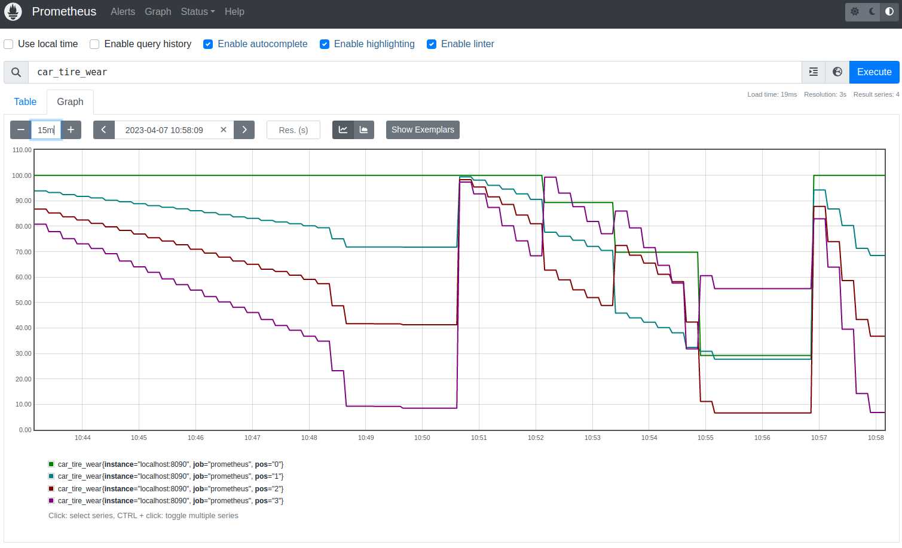

You have a few options for integrating your metrics with Prometheus.  You can use [gNMIc]() or `freeconf/example/fcprom` module. This document explores the later.



## Demonstrates:

* How to use export application metrics to Prometheus
* How to use YANG extensions to improve to Prometheus results
* Decoupling your application from Prometheus

## Details

The `fcprom` module auto-discovers all metrics from your application.  Just add the `fcprom.Bridge` service to your `Device` and you're off and running.

The important point is not the time saving but that your application is not restricted to Prometheus.  So you can use Prometheus in development and something else in production or vice versa.  Prometheus comes with an integrated UI and time series DB making it the perfect developer tool.

## How it works

The `fcprom.Bridge` walks thru each `Browser` in the local `Device` browsing the YANG for metrics (i.e. `config false`) to build the Prometheus `/metrics` endpoint generating labels and descriptions from the YANG and of course grabbing the metric value.

Because YANG doesn't understand Prometheus' metrics types like `gauge` or `counter` or know how you want to flatten metrics in YANG `lists`, the `fcprom` module  uses YANG extensions to help your control the translation. YANG extensions are ignored by other systems.

### Defining some extensions

```YANG
module metrics-extension {
    prefix "m";
    namespace "freeconf.org";
    description "Classify metrics into certain types so tools like Prometheus can handle them correctly";
    revision 0000-00-00;
    
	extension gauge {
        description "a value that goes up and down.  this is the default type if not specfied";
	}

	extension counter {
        description "a value that only goes up and is always positive.  Roll over is normal as well as reset on restart";
	}

    extension multivariate {
        description "one or more fields (from same node) to use values as label in metric report";
    }
}
```

### Using our extensions

```YANG
module car {
	description "Car goes beep beep";

	revision 2023-03-27;
	namespace "freeconf.org";
	prefix "car";

    import metrics-extension {
        prefix "metric";
    }

	leaf running {
		type boolean;
		config false;
	}
	
	leaf speed {
		description "How fast the car goes";
	    type int32;
		units milesPerSecond;
		default 1000;
		metric:counter;
	}

	leaf miles {
		description "How many miles has car moved";
		config false;
	    type decimal64 {
			fraction-digits 2;
		}
	}

	leaf lastRotation {
		type int64;
		config false;
	}

	list tire {
		description "Rubber circular part that makes contact with road";
		key "pos";
		metric:multivariate;

        leaf pos {
            type int32;
        }
        leaf size {
            type string;
            default 15;
        }
        leaf worn {
            config false;
            type boolean;
        }
        leaf wear {
            config false;
            type decimal64 {
				fraction-digits 2;
			}
        }
        leaf flat {
            config false;
            type boolean;
        }

		action replace {
			description "replace just this tire";
		}
	}

    container engine {        
        anydata specs;
    }

	rpc reset {
		description "Reset the odometer";
	}

    rpc rotateTires {
        description "Rotate tires for optimal wear";
    }

    rpc replaceTires {
        description "Replace all tires";
    }

    notification update {
        description "Important state information about your car";
		leaf event {
			type enumeration {
				enum carStarted {
					value 1;
				}
				enum carStopped;
				enum flatTire;				
			}
		}
    }
}
```

## Running the example



## Setup and Run Prometheues

1.) [Download and install Prometheus](https://prometheus.io/docs/introduction/first_steps/)

2.) Start Prometheus with the example configuration here.

```bash
cd fcprom
prometheus --config.file=prometheus.yml
```

file: `prometheus.yml`
```yaml
global:
  scrape_interval:     15s
  evaluation_interval: 15s

rule_files:
  # - "first.rules"
  # - "second.rules"

scrape_configs:
  - job_name: prometheus
    static_configs:
      - targets: ['localhost:8090']

```

## Running Application

```bash
cd fcprom/cmd
go run .
```

### Render Graph

Go to [http://localhost:9090/](http://localhost:9090/) and enter `car_tire_wear` as expression

## Using `fcprom` in your applications

```go
package main

import (
	"flag"
	"log"
	"strings"

	"github.com/freeconf/examples/car"
	"github.com/freeconf/examples/fcprom"
	"github.com/freeconf/restconf"
	"github.com/freeconf/restconf/device"
	"github.com/freeconf/yang/source"
)

// Connect everything together into a server to start up
func main() {
	flag.Parse()

	// Your app here
	app := car.New()

	// where the yang files are stored
	ypath := source.Path("../../yang:..")

	// Device is just a container for browsers.  Needs to know where YANG files are stored
	d := device.New(ypath)

	// Device can hold multiple modules, here we are only adding one
	if err := d.Add("car", car.Manage(app)); err != nil {
		panic(err)
	}

	// Prometheus will look at all local modules which will be car and fc-restconf
	// unless configured to ignore the module
	p := fcprom.NewBridge(d)
	if err := d.Add("fc-prom", fcprom.Manage(p)); err != nil {
		panic(err)
	}

	// Select wire-protocol RESTCONF to serve the device.
	restconf.NewServer(d)

	// apply start-up config normally stored in a config file on disk
	config := `{
		"fc-restconf":{
			"web":{
				"port":":8090"
			}
		},
		"fc-prom" : {
			"service" : {
				"useLocalServer" : true
			}
		},
        "car":{"speed":10}
	}`
	if err := d.ApplyStartupConfig(strings.NewReader(config)); err != nil {
		panic(err)
	}

	if !*testMode {
		// wait for ctrl-c
		log.Printf("server started")
		select {}
	}
}

var testMode = flag.Bool("test", false, "do not run in background (i.e. driven by unit test)")

```

While you could import `fcprom` into your application directly by calling `go get github.com/freeconf/example` this example code may change without notice.

## Tips for extending:
*  With less than 400 lines of code we can integrate all modules with Prometheus. This would make a good starter for a project for someone until Prometheus understands either RESTCONF or gNMI natively.
* If you wanted to integrate the Prometheus module into a remote module, the [FreeCONF remote client browser API]() looks identical to the local browser API and so this code could easily be extended to be remotely pull metrics from applications and not have to expose `/metrics` endpoint.
* It's likely you can come up with more extensions like `metrics:ignore` to skip data or `metrics:label` to override the default label.
