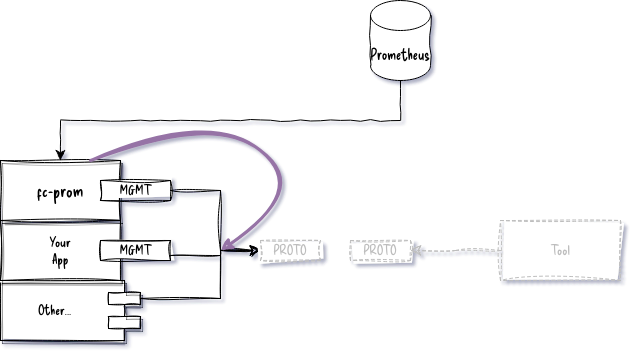
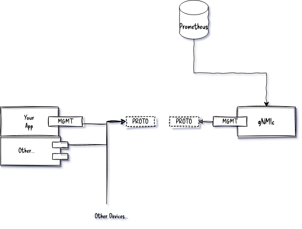

You have a few options for integrating your metrics with Prometheus.  You can use [gNMIc]() or `freeconf/example/fcprom` module. This document explores the later.


## Demonstrates:

* How to use export FreeCONF application metrics to Prometheus w/o coupling your application code to Prometheus
* How to use YANG extensions to improve to Prometheus results

## Details

The `fcprom.Bridge` walks thru all the local management interfaces and auto-discovers all metrics (i.e. `config false` in YANG) and makes them available to Prometheus.



Because YANG doesn't understand Prometheus' metrics types like `gauge` or `counter` or know how you want to flatten metrics in YANG `lists`, the `fcprom` module  uses YANG extensions to help you control the translation. YANG extensions are ignored by other systems.

### Defining some extensions

```YANG
module metrics-extension {
    prefix "m";
    namespace "freeconf.org";
    description "Classify metrics into certain types so tools like Prometheus can handle them correctly";
    revision 0000-00-00;
    
	extension gauge {
        description "a value that goes up and down.  this is the default type if not specfied";
	}

	extension counter {
        description "a value that only goes up and is always positive.  Roll over is normal as well as reset on restart";
	}

    extension multivariate {
        description "one or more fields (from same node) to use values as label in metric report";
    }
}
```

### Using our extensions

```YANG
module car {
	description "Car goes beep beep";

	revision 2023-03-27;
	namespace "freeconf.org";
	prefix "car";

    import metrics-extension {
        prefix "metric";
    }

	leaf running {
		type boolean;
		config false;
	}
	
	leaf speed {
		description "How fast the car goes";
	    type int32;
		units milesPerSecond;
		default 1000;
		metric:counter;
	}

	leaf miles {
		description "How many miles has car moved";
		config false;
	    type decimal64 {
			fraction-digits 2;
		}
	}

	leaf lastRotation {
		type int64;
		config false;
	}

	list tire {
		description "Rubber circular part that makes contact with road";
		key "pos";

		// used to help flatten metrics in lists
		metric:multivariate;

        leaf pos {
            type int32;
        }
        leaf size {
            type string;
            default 15;
        }
        leaf worn {
            config false;
            type boolean;
        }
        leaf wear {
            config false;
            type decimal64 {
				fraction-digits 2;
			}
        }
        leaf flat {
            config false;
            type boolean;
        }

		action replace {
			description "replace just this tire";
		}
	}

    container engine {        
        anydata specs;
    }

	rpc reset {
		description "Reset the odometer";
	}

    rpc rotateTires {
        description "Rotate tires for optimal wear";
    }

    rpc replaceTires {
        description "Replace all tires";
    }

    notification update {
        description "Important state information about your car";
		leaf event {
			type enumeration {
				enum carStarted {
					value 1;
				}
				enum carStopped;
				enum flatTire;				
			}
		}
    }
}
```

## Running the example



## Setup and Run Prometheues

1.) [Download and install Prometheus](https://prometheus.io/docs/introduction/first_steps/)

2.) Start Prometheus with the example configuration here.

```bash
cd fcprom
prometheus --config.file=prometheus.yml
```

file: `prometheus.yml`
```yaml
global:
  scrape_interval:     15s
  evaluation_interval: 15s

rule_files:
  # - "first.rules"
  # - "second.rules"

scrape_configs:
  - job_name: prometheus
    static_configs:
      - targets: ['localhost:8090']

```

## Running Application

```bash
cd fcprom/cmd
go run .
```

### Render Graph

Go to [http://localhost:9090/](http://localhost:9090/) and enter `car_tire_wear` as expression

## Using `fcprom` in your applications

```go
package main

import (
	"flag"
	"log"
	"strings"

	"github.com/freeconf/examples/car"
	"github.com/freeconf/examples/fcprom"
	"github.com/freeconf/restconf"
	"github.com/freeconf/restconf/device"
	"github.com/freeconf/yang/source"
)

// Connect everything together into a server to start up
func main() {
	flag.Parse()

	// Your app here
	app := car.New()

	// where the yang files are stored
	ypath := source.Path("../../yang:..")

	// Device is just a container for browsers.  Needs to know where YANG files are stored
	d := device.New(ypath)

	// Device can hold multiple modules, here we are only adding one
	if err := d.Add("car", car.Manage(app)); err != nil {
		panic(err)
	}

	// Prometheus will look at all local modules which will be car and fc-restconf
	// unless configured to ignore the module
	p := fcprom.NewBridge(d)
	if err := d.Add("fc-prom", fcprom.Manage(p)); err != nil {
		panic(err)
	}

	// Select wire-protocol RESTCONF to serve the device.
	restconf.NewServer(d)

	// apply start-up config normally stored in a config file on disk
	config := `{
		"fc-restconf":{
			"web":{
				"port":":8090"
			}
		},
		"fc-prom" : {
			"service" : {
				"useLocalServer" : true
			}
		},
        "car":{"speed":10}
	}`
	if err := d.ApplyStartupConfig(strings.NewReader(config)); err != nil {
		panic(err)
	}

	if !*testMode {
		// wait for ctrl-c
		log.Printf("server started")
		select {}
	}
}

var testMode = flag.Bool("test", false, "do not run in background (i.e. driven by unit test)")

```

## Conclusion

### Comparison to gNMIc approach



This has advantage of working with all gNMIc compliant devices. 

In general, FreeCONF is a library to build your own solutions, gNMIc is a utility to use in production as is. You can decide at any point which approach works for you without having to change your application code, just your deployment strategy.

### Using this example code

If you wanted to use the approach here as is, you could import `fcprom` into your application directly by calling `go get github.com/freeconf/example` but this example code may change without notice.  It's intention is to give you a starter project to customize as needed.

### Expanding on this example code

[Open a discussion](https://github.com/orgs/freeconf/discussions) about what you'd like to see or feel free to make an annoucement on what you built.

**Ideal architecture:**


### Tips for extending:
* Consider adding more YANG extensions like `metrics:ignore` to skip data or `metrics:label` to override the default label.
