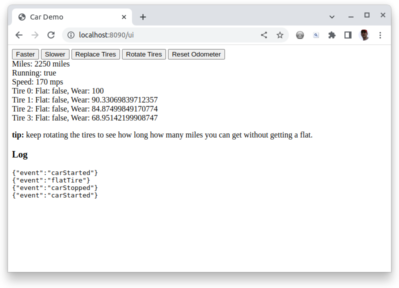
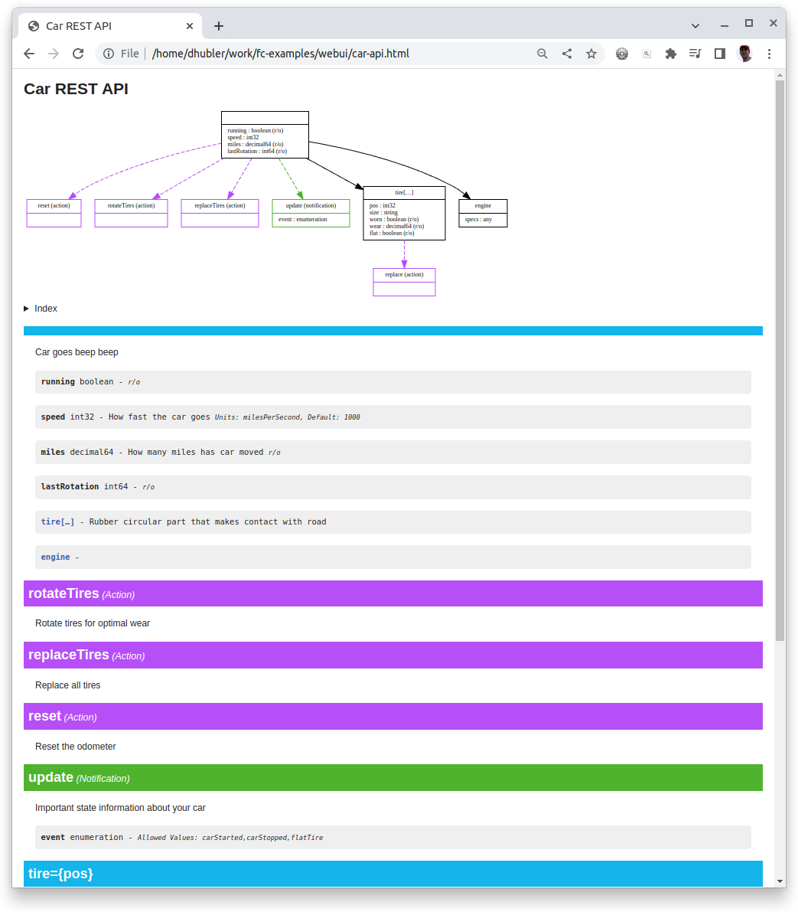
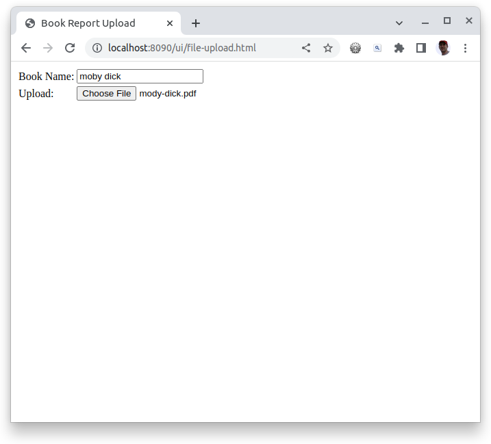
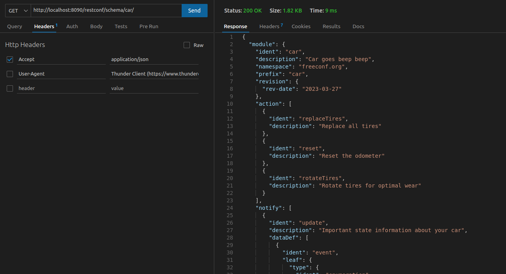
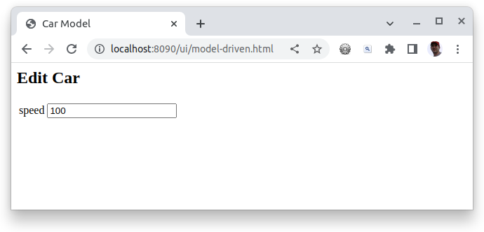

While automation is primarily about APIs, building administration portals enable non-developers to interact with your application and another point of access for developers.

## Car Admin Portal

### Notes:
* This example web code is very basic, but you can use advanced web frameworks
* Read [how to use RESTCONF API]() to understand how to navigate data. 
* Serving your web interface with your application ensures they are always deployed together and therefore compatible.



```javascript
// Basic calls to interact with the "car" RESTCONF API

let car = null;

// Reading config AND metrics together for the whole car
function update() {
    fetch("/restconf/data/car:").then((resp) => {
        return resp.json();
    }).then((data) => {
        car = data;
        let e = document.getElementById("car");
        e.innerHTML = `
            <div>Miles: ${data.miles} miles</div>
            <div>Running: ${data.running}</div>
            <div>Speed: ${data.speed} mps</div>
            ${data.tire.map((tire, index) =>
                `<div>Tire ${index}: Flat: ${tire.flat}, Wear: ${tire.wear}</div>`
            ).join('')}
        `;
    });
};

// Call one of the RPCs. ours are simple, no input or expected output but
// you could easily add them here
function run(action) {
    fetch(`/restconf/data/car:${action}`, {
        method: 'POST',
    }).then(() => {
        update();
    });
}       

// Update config edit.  
//   PATCH is like an upsert. 
//   PUT is like a delete and replace with this.
//   POST is create new
function speed(s) {
    fetch('/restconf/data/car:', {
        method: 'PATCH',
        body : JSON.stringify({
                speed: car.speed + s
            })
    }).then(() => {
        update();
    });                
}

// Subscribe to notifications. EventSource is part of every browser and works 
// on HTTP (i.e. http) but more efficient on HTTP/2 (i.e. https)
function subscribeToUpdateEventStream() {
    // this will appear as a pending request.
    const events = new EventSource("/restconf/data/car:update?simplified");
	events.addEventListener("message", e => {
        // this decodes SSE events for you to give you just the messages
        const log = document.getElementById("log");
        log.appendChild(document.createTextNode(e.data + '\n'));
	});
    // to unsubscribe just close the stream.
    //  events.close();
}

// Metrics change too often for subscription so just get the latest
// every 2s.
const pollInterval = 2000;
function pollforUpdates()  {
    update();
    setTimeout(pollforUpdates, pollInterval);
}

// initial read of data
pollforUpdates();
// watch for update events as they happen, no polling here
subscribeToUpdateEventStream();

```

```html
<html><!DOCTYPE html>
<html lang="en">
    <head>
        <title>Car Demo</title>
        <meta name="viewport" content="width=device-width, minimum-scale=1, initial-scale=1, user-scalable=yes">
    </head>
    <body>  
        <div>
            <button onclick='speed(10)'>Faster</button>
            <button onclick='speed(-10)'>Slower</button>
            <button onclick='run("replaceTires")'>Replace Tires</button>
            <button onclick='run("rotateTires")'>Rotate Tires</button>
            <button onclick='run("reset")'>Reset Odometer</button>    
        </div>
        <div id="car"></div>
        <p><b>tip:</b> keep rotating the tires to see how long how many miles you can get without getting a flat.</p>
        <script src="/ui/app.js"></script>
        <h3>Log</h3>
        <pre id="log"></pre>
    </body>
</html>
```

### Additional Notes:

* **Register custom request endpoints** - Not everything has to be handled thru RESTCONF. Use standard web request handlers for any custom endpoints.
* **Use `notification` for interactive UIs** - Notifications aren't just for alerts. One of the more useful notifications is for data has changed in back-end from possibly another user edit and front-end should reload data
* **Consider a web-only module** - You can serve any number of modules in an application should you need to isolate your web-only functions.  For example `car` module and `car-web` module both from the same server.
* **Generate REST API Docs**  - [Generate REST API docs]() to know what is available from REST.
   

```sh
#!/usr/bin/env sh
set -eu

FC_YANG="go run github.com/freeconf/yang/cmd/fc-yang"
YPATH=../car
MODULE=car

# HTML API Docs
${FC_YANG} doc -f dot -module ${MODULE} -ypath ${YPATH} > ${MODULE}.dot
dot -Tsvg ${MODULE}.dot -o ${MODULE}.svg
${FC_YANG} doc -f html -module ${MODULE} -title "Car REST API" -ypath ${YPATH} > ${MODULE}-api.html

# Markdown API Docs
${FC_YANG} doc -f md -module ${MODULE} -ypath ${YPATH} > ${MODULE}-api.md

```

## File Uploading



```yang
module file-upload {
    namespace "freeconf.org";
    prefix "f";

    rpc bookReport {
        input {
            leaf bookName {
                description "Name of the book";
                type string;
            }

            anydata pdf {
                description "PDF of file upload";
            }
        }
        output {
            leaf fileSize {
                description "";
                type uint64;
            }
        }
    }
}
```

## Frontend

```html
<html><!DOCTYPE html>
<html lang="en">
    <head>
        <title>Book Report Upload</title>
        <meta name="viewport" content="width=device-width, minimum-scale=1, initial-scale=1, user-scalable=yes">
    </head>

    <body>
        <table>
            <tr>
                <td><label for="bookName">Book Name:</label></td>
                <td><input id="bookName"></td>
            </tr>
        
            <tr>
                <td><label for="pdf">Upload:</label></td>
                <td><input type="file" id="pdf" onchange='upload()'></td>
            </tr>
        </table>
        <script src="/ui/file-upload.js"></script>
    </body>
</html>
```

```javascript

// grab the form data and upload the file to RESTCONF rpc
function upload() {
    const bookName = document.getElementById("bookName").value;
    const pdf = document.getElementById("pdf").files[0];
    const form = new FormData();
    form.append("bookName", bookName); // YANG: leaf bookName { type string; }
    form.append("pdf", pdf);           // YANG: anydata pdf;
    fetch("/restconf/data/file-upload:bookReport", {
      method: "POST",
      body: form
    })
    .then(resp => resp.json())
    .then((data) => {
        window.alert(`success. file size is ${data.fileSize}`);
    });
}
```

## Backend

Go will see the `anydata` as an `io.Reader`.

```go
package main

import (
	"io"

	"github.com/freeconf/yang/node"
	"github.com/freeconf/yang/nodeutil"
)

// matches rpc input of uploading a book report
type upload struct {
	BookName string
	Pdf      io.Reader
}

// handle just one thing, file upload of book report
func manageUploader() node.Node {
	return &nodeutil.Basic{
		OnAction: func(r node.ActionRequest) (node.Node, error) {
			switch r.Meta.Ident() {
			case "bookReport":

				// you should do more validation of input data
				var req upload
				r.Input.UpdateInto(nodeutil.ReflectChild(&req))
				data, err := io.ReadAll(req.Pdf)
				if err != nil {
					return nil, err
				}

				// we throw away the report, but you'd probably want to keep it

				// tell user the file size as proof we got it
				resp := struct {
					FileSize uint64
				}{
					FileSize: uint64(len(data)),
				}

				return nodeutil.ReflectChild(&resp), nil
			}
			return nil, nil
		},
	}
}

```

## Model Driven UI

Being able to read the information in the YANG file from your web application is nothing short of game changing. Here are **just a few of the possibilities**: 
1. client-side form validation
2. build forms dynamically including simple things like select list options from leaf enumerations
4. form labels from leaf names and tooltips from descriptions
5. list of available columns in a table
6. reports

Combine this with ability to extend the YANG with your own meta data the **possibilites are endless**. For example:
1. mark `leafs` as password fields
2. marking fields that require web custom handlers
3. fields that should be shown to advanced users
4. fields that should only show if feature flag is on

The path to the meta definitions is just `/restconf/schema/{module}/` and requires header `Accept: application/json` to return the YANG file in JSON form.  You can use all normal RESTCONF navigation features to drill in to the just the part of the YANG file you are interested in.






```html
<html><!DOCTYPE html>
<html lang="en">
    <head>
        <title>Car Model</title>
        <meta name="viewport" content="width=device-width, minimum-scale=1, initial-scale=1, user-scalable=yes">
    </head>
    <body>
        <h2>Edit Car</h2>
        <div id="form"></div>
        <script src="/ui/model-driven.js"></script>
    </body>
</html>
```

```javascript
// load the schema (YANG) and the object for editing
function load(module) {
    const parent = document.getElementById("form");
    Promise.allSettled([
        fetch(`/restconf/data/${module}:`)
            .then(resp => resp.json()),
        fetch(`/restconf/schema/${module}/`, {
            method: 'GET',
            headers: {'Accept': 'application/json'}
        }).then(resp => resp.json()),
    ]).then((responses) => {
        render(parent, responses[0].value, responses[1].value.module);
    });
}

// navigate thru the meta along with the object to build forms but
// as a pattern for all model driven UI
function render(parent, obj, meta) {
    const editableFields = meta.dataDef.filter(def => {
        // ignore mertics
        if (def.leaf?.config == false) {
            return false;
        }
        // would normally recurse here
        if ('list' in def || 'container' in def) { 
            return false;
        }
        return true;
    })
    // here you would normally adjust the input type based on details
    // in the 'def' object like number v.s. string, etc.
    parent.innerHTML = `
        <table>
        ${editableFields.map(def => `
            <tr>
                <td><label>${def.ident}</label></td>
                <td><input value="${obj[def.ident] || ''}"></td>
            </tr>
        </table>`).join('')}
    `;

    // recurse into lists and containers here
}

// car is not a very exciting object to edit but still demonstrates feature
load('car');

```