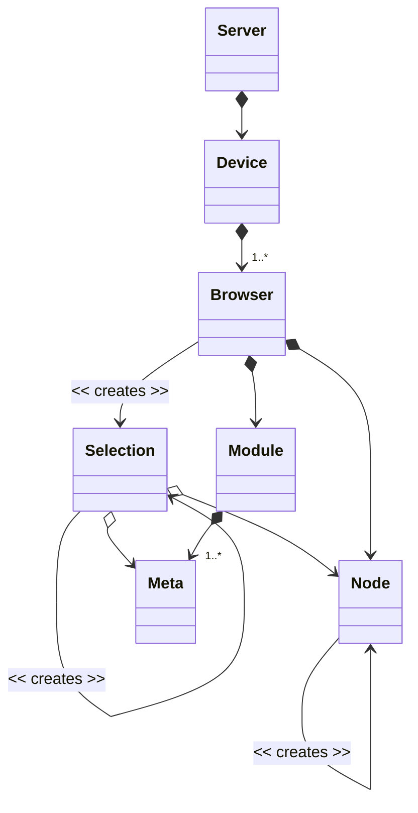

When using the FreeCONF developer API you'll likely be interfacing with these six FreeCONF components:

1. **Module** - the parsed YANG model (i.e. AST). From this single meta object, you can reach the meta definitions for every single item in the YANG file including custom extensions.
2. **Node** - custom code you write that connects the definitions in Module to your application. As your management API is called, Nodes are responsible for returning more Nodes to navigate your application. Nodes are also responsible for handling each configuration field, each metric, each notification and each function. You can use a variety of methods to implement your Nodes from:
   * writing each by hand
   * reflection
   * generated from code
   * library of base implementations you have developed 
   * nodes that read or write from/to JSON, YAML, XML
   * nodes that read and write from/to a database
   * nodes that proxy to other nodes including remote ones to create a client
   * nodes that extend other nodes
   * yet to be developed
   * any combination of the above
3. **Selection** - a pairing of a node and a meta definition that lets you navigate and operate on your application's live objects.
4. **Browser** - Where to get the first Selection object known as the root Selection.
5. **Device** - Holds a set of Browsers that you elect to make available in your management API.
6. **Server** - Handles the communication in and out of your Device.  It understands the protocol and responsible for interoperability with clients communicating with your Device.

